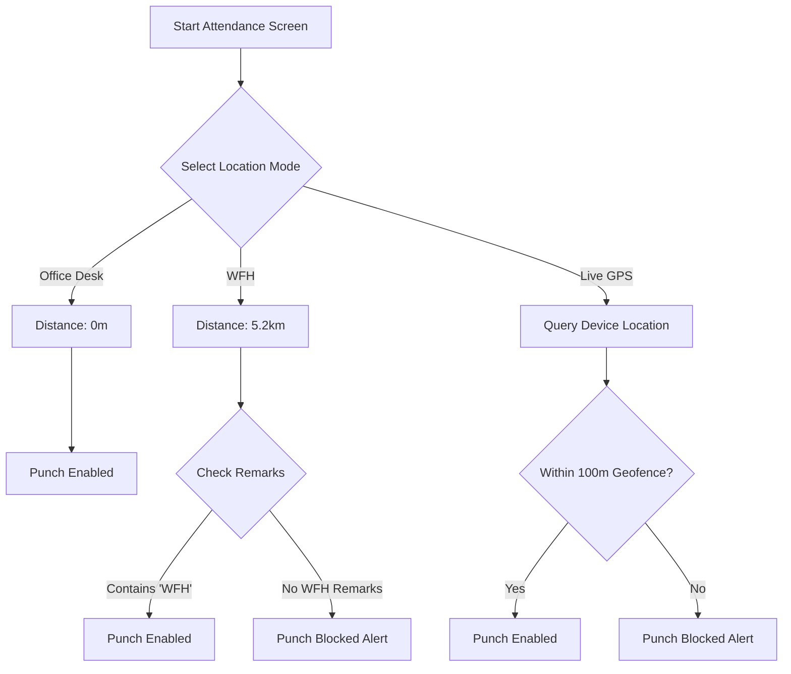

# ACV Mobile Testing Strategy

This document outlines the testing strategy, manual verification checklists, geofence simulation protocols, and release standards for the **AuroraHR Mobile Application** (Expo/React Native). These protocols ensure stability during the **ACV Solutions Customer Zero** pilot launch.

---

## 1. Testing Frameworks & Automation

The application uses a test suite combining unit testing and UI testing.

### Automated Unit Testing
- **Preset**: Jest with React Native configurations (`jest.config.js`).
- **Key Testing Libraries**:
  - `@testing-library/react-native` for component render testing and user event triggers.
  - `react-test-renderer` for snapshotting.
- **Test Command**: `npm test` (Runs Jest with coverage analysis).
- **Automation Status**: 5 test suites (25 tests total) are implemented and passing, covering:
  1.  `src/context/__tests__/useAuthStore.test.ts` (State and login storage flows).
  2.  `src/api/__tests__/client.test.ts` (Interceptors, access token injections, and refresh requests).
  3.  `src/screens/hr-command/__tests__/HRCommandCenter.test.tsx` (Tab render tests).
  4.  `src/screens/hr-command/__tests__/OnboardingDetail.test.tsx` (Orientation schedules render tests).
  5.  `src/screens/hr-command/__tests__/ProbationReview.test.tsx` (Form option selection tests).

---

## 2. Manual QA Functional Verification Checklist

Manual testers must execute the following flows on emulators or physical test hardware:

### Flow 1: Authentication & Biometrics
1.  **Standard Credentials Login**: Enter email and password. Verify successful dashboard redirect.
2.  **State Verification**: Verify that standard user metadata is written to `AsyncStorage` and access tokens are saved in `SecureStore`.
3.  **Biometrics Activation**: Navigate to Profile ➔ settings. Enable biometrics. Log out.
4.  **Biometric Lock Check**: Relaunch app. Verify that the app blocks auto-login, launches the biometric prompt, and unlocks only on success.
5.  **Passcode Fallback**: Cancel the biometric prompt. Verify that the login screen displays credential fallback inputs.

### Flow 2: Digital Vault Document Preview & Share
1.  **Biometric Gate**: Navigate to "Doc Hub". Verify that the Payslips and Issued Docs tabs prompt for biometrics and block access on failure/cancellation.
2.  **In-App Document Preview**: Tap "View" on a payslip. Verify that the browser opens `/api/v1/digital-library/:id/view?token=<JWT>` inside an in-app overlay.
3.  **Document Share**: Tap "Share" on an issued document. Verify that the file downloads and triggers the native OS sharing/save drawer.
4.  **Public Policies**: Navigate to "Policies". Verify that no biometric authentication is requested and files are accessible.

### Flow 3: Leave Application & Approvals
1.  **Leave Balance**: Navigate to "Leave". Verify that balance metrics load.
2.  **Submit Leave**: Tap "Apply New". Enter valid date strings and reasons. Verify submission and list log update.
3.  **Manager Review**: Log in as a manager. Open "Leave" ➔ "Approvals". Verify that the pending request appears.
4.  **Approve/Reject**:
    - Tap "Approve". Confirm. Verify that the status updates to Approved.
    - Tap "Reject". Enter comments. Verify that the status updates to Rejected and comment text appears on the employee's history card.

---

## 3. Geofencing Test Protocol

Attendance clock-in relies on a 100-meter geofence from Acme coordinates. Tester should verify geofencing behavior using the mock location selector:



### Verification Scenarios
1.  **Acme HQ Punch**: Select "Office Desk". Remarks are empty. Tap "Clock In". Verify clock-in success and active timer initiation.
2.  **WFH Punch Bypass Block**: Select "WFH". Remarks are empty. Tap "Clock In". Verify that the app blocks the punch and prompts for "WFH" remarks.
3.  **WFH Punch Success**: Type "Working from home" in remarks. Tap "Clock In". Verify punch success.
4.  **GPS Simulation**: Select "Live GPS". Simulate coordinates in Xcode simulator or Android emulator (Location settings). Verify that distance displays correctly and punches are blocked outside the 100m geofence.

---

## 4. Biometric UAT Test Script

| Step | Action | Expected Behavior | Status |
| :--- | :--- | :--- | :--- |
| **1** | Navigate to Profile Settings and toggle biometrics active. | Prompt asks for biometrics check. Saves state toggles in standard AsyncStorage. | Verified |
| **2** | Force close and restart the application. | App displays "Secure Biometric Gateway" screen and calls local hardware authenticate. | Verified |
| **3** | Accept biometric check successfully. | Screen fades out, session is decrypted, and Dashboard is displayed. | Verified |
| **4** | Reject / Cancel biometric check. | Screen prompts for user password, blocking access to the dashboard. | Verified |
| **5** | Tap "Doc Hub" ➔ "Payslips" while authenticated. | A biometric lock screen appears. Fingerprint/Face validation is required to list files. | Verified |

---

## 5. Release & Packaging checklist

Before building final release bundles (`.ipa` / `.apk`) for app store publishing, verify:

1.  **Configure API Environment**: Update `src/api/client.ts` base URL. Replace `localhost` addresses with the staging or production domain.
2.  **EAS Build Environment**: Set up Expo Application Services (EAS). Build release profiles:
    ```bash
    eas build --platform ios --profile production
    eas build --platform android --profile production
    ```
3.  **Hardware Permissions**: Verify permissions settings in `app.json`:
    - `NSLocationWhenInUseUsageDescription` (iOS Location permission).
    - `ACCESS_COARSE_LOCATION` / `ACCESS_FINE_LOCATION` (Android Location permissions).
    - `NSFaceIDUsageDescription` (iOS Biometrics permissions).
4.  **App Store Optimization**: Run bundle analyzer to optimize app bundle size before uploading to App Store Connect and Google Play Console.
