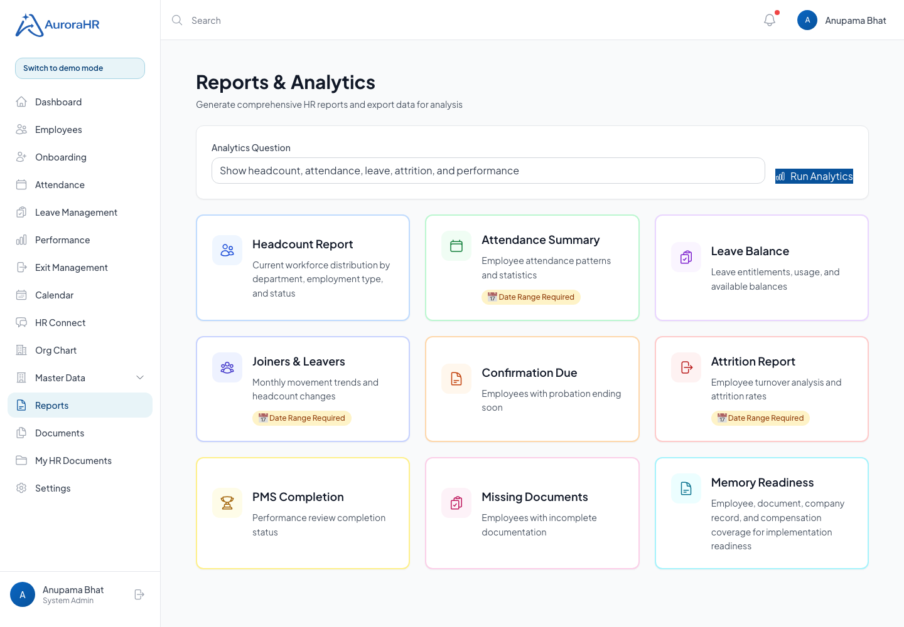
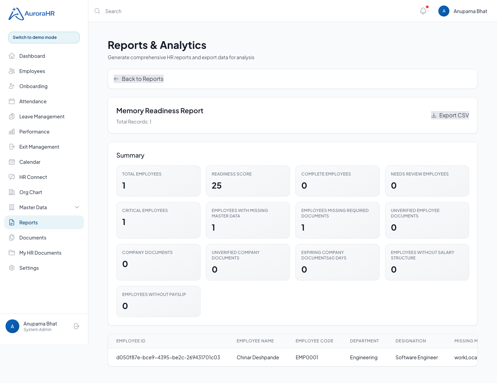
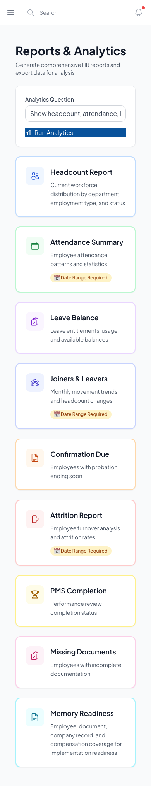
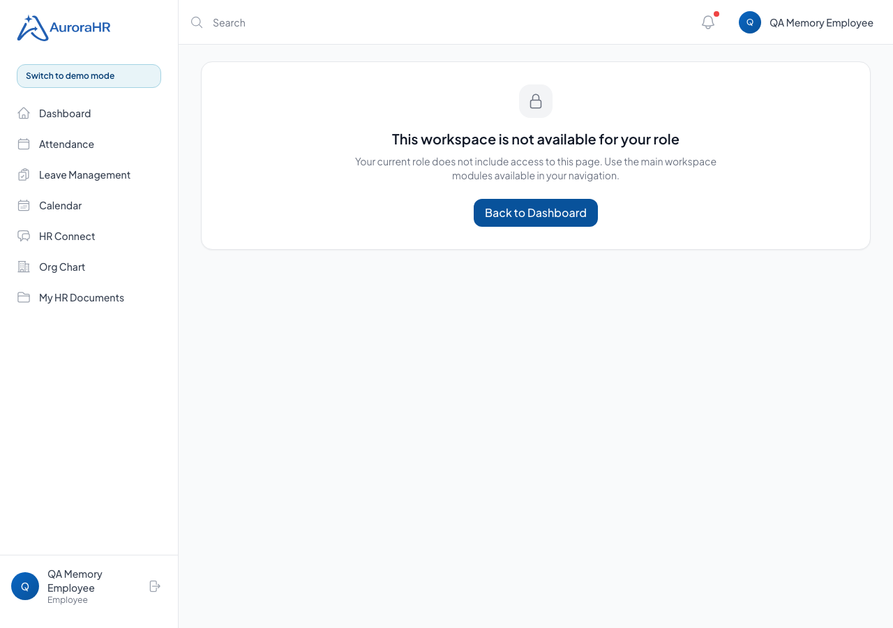

# ACV Memory Foundation Production Readiness Visual QA

Run date: 2026-05-23
Run id: ACV-MEM-2026-05-23-1779558265199
Target: http://localhost:5186
API: http://localhost:5000/api/v1

## Executive Summary

- Passed: 24
- Failed: 0
- Skipped: 0
- Production-readiness verdict: Production-readiness QA passed for this local slice.

## Scope

This run validates the ACV Memory Foundation slice: company document vault, employee document memory, missing document reporting, memory readiness reporting, role-based access, export behavior, and report navigation.

## Personas And Data

- Admin: anupama.bhat@acvsolutions.in
- Temporary employee role: created only for this run and cleaned up after execution when database cleanup is available.
- Temporary manager role: created only for this run and cleaned up after execution when database cleanup is available.
- Target employee: first active ACV employee returned by the local tenant.

## Business Process Narrative

ACV HR must be able to turn scattered HR memory into structured tenant data: company compliance documents, employee documents, compensation coverage, payslips, and readiness reports. The test validates that HR/Admin can operate this memory layer, employees can access only their own employee records, managers cannot write HR-controlled documents, and implementation reports are usable from the UI and exportable for migration evidence.

## Test Outcomes

| ID | Use case | Role | Expected | Actual | Status | Evidence | Notes |
| --- | --- | --- | --- | --- | --- | --- | --- |
| AUTH-01 | ACV admin login | admin | Admin can authenticate against local ACV tenant | anupama.bhat@acvsolutions.in / system_admin | PASSED |  |  |
| AUTH-02 | Unauthenticated request protection | public | Memory readiness rejects missing token | HTTP 401 | PASSED |  |  |
| REP-01 | Memory readiness report | admin | Admin can run readiness report with summary and employee rows | score=25, rows=1 | PASSED |  |  |
| REP-02 | Missing documents report | admin | Report uses durable employee document vault and returns tabular rows | rows=1 | PASSED |  |  |
| REP-03 | Employee report access boundary | employee | Employee cannot run implementation readiness report | HTTP 403 | PASSED |  |  |
| REP-04 | Manager report access boundary | manager | Manager cannot run implementation readiness report | HTTP 403 | PASSED |  |  |
| CDOC-01 | Company document invalid upload | admin | Company vault rejects upload without file | HTTP 400 | PASSED |  |  |
| CDOC-02 | Company document upload | admin | Admin uploads company HR policy document with metadata | documentId=40d4f249-f7e9-4a99-a624-56a63650cf8b | PASSED |  |  |
| CDOC-03 | Company document search and filter | admin | Uploaded company document can be filtered by category/search | found=true | PASSED |  |  |
| CDOC-04 | Company document verify/download/archive | admin | Verification, download, and archive paths work | verified=verified, bytes=42, status=archived | PASSED |  |  |
| CDOC-05 | Company document role boundary | employee | Employee cannot access company document vault | HTTP 403 | PASSED |  |  |
| EDOC-01 | Employee document invalid employee | admin | Upload against non-existent employee fails safely | HTTP 404 | PASSED |  |  |
| EDOC-02 | Employee document upload | admin | HR uploads employee identity document with metadata | documentId=a4ae18a1-5a01-4ead-a124-9bb93c90063d | PASSED |  |  |
| EDOC-03 | Employee document self-service read | employee | Employee can read own employee documents | found=true | PASSED |  |  |
| EDOC-04 | Employee document cross-employee boundary | employee | Employee cannot read another employee document area | HTTP 403 | PASSED |  |  |
| EDOC-05 | Employee document verify/download/archive | admin/employee | Verify, employee download, and archive paths work | verified=verified, bytes=42, status=archived | PASSED |  |  |
| EDOC-06 | Employee document manager write boundary | manager | Manager cannot upload employee document | HTTP 403 | PASSED |  |  |
| STRESS-01 | Memory readiness repeated load | admin | Readiness endpoint handles repeated concurrent reads | requests=25, durationMs=163 | PASSED |  |  |
| UI-01 | Reports navigation | admin | Memory Readiness card is visible | Card visible on /reports | PASSED | screenshots/desktop-reports-memory-card.png |  |
| UI-02 | Memory readiness visual report | admin | Summary and table render after clicking card | Report rendered | PASSED | screenshots/desktop-memory-readiness-report.png |  |
| UI-03 | Memory readiness CSV export | admin | Export CSV creates downloadable evidence file | Memory_Readiness_Report_2026-05-23.csv | PASSED |  |  |
| UI-04 | Back navigation | admin | Back to Reports returns to report card grid | Report card grid visible | PASSED |  |  |
| UI-05 | Mobile report navigation | admin | Memory Readiness is reachable on mobile without major horizontal overflow | overflowPx=0 | PASSED | screenshots/mobile-reports-memory-card.png |  |
| UI-06 | Direct route permission check | employee | Employee direct route to /reports is denied | Access denied page rendered | PASSED | screenshots/employee-reports-denied.png |  |

## Visual Proof

### UI-01: Reports & Analytics shows Memory Readiness card.



### UI-02: Memory Readiness report with summary and employee rows.



### UI-05: Mobile reports view with Memory Readiness card.



### UI-06: Employee direct-route access to reports is denied.



## API Proof

- /api/v1/reports/memory-readiness
- /api/v1/reports/missing-documents
- /api/v1/company-documents
- /api/v1/employee-documents/employees/:employeeId
- /api/v1/company-documents/:documentId/download
- /api/v1/employee-documents/:documentId/download

## Gaps Found

- No blocker or high-severity gaps found in this local QA run.

## Repairs Made

- No code repair was required during this QA run.

## Residual Risks

- This is a local ACV tenant test, not a production live-site run.
- The stress check is endpoint-level repeated-read pressure, not full infrastructure load testing.
- Email/Zoho, full inbound communications, and WorkDrive sync remain out of scope for this sprint.

## Rerun Commands

```bash
QA_BASE_URL=http://localhost:5186 QA_API_URL=http://localhost:5000/api/v1 node scripts/qa/acv-memory-foundation-qa.mjs
```
