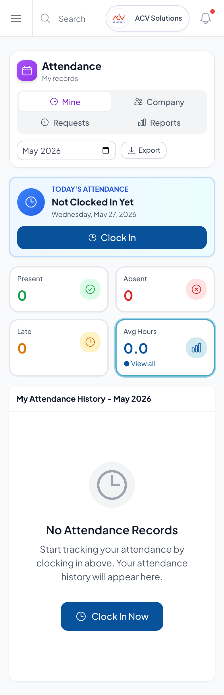
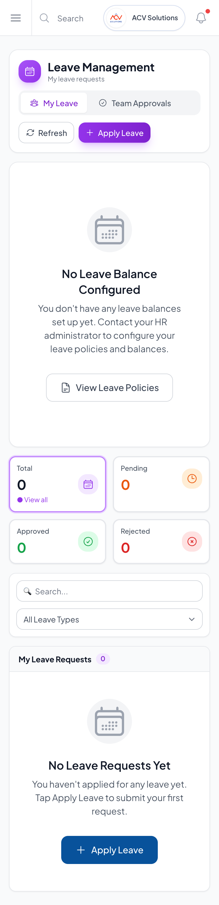
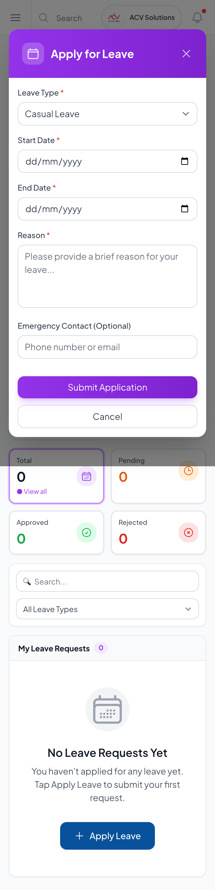

# Attendance and Leave Mobile Journey Hardening

Run date: 2026-05-27
Run id: attendance-leave-mobile-hardening-2026-05-27
Target: http://localhost:5173
API: http://localhost:3000/api/v1
Persona used: anupama.bhat@acvsolutions.in

## Executive Summary

- Passed: 3 mobile visual smoke scenarios
- Failed: 0 in the final localhost run
- Production-readiness verdict: improved, but not complete. The employee self-service surfaces are cleaner on mobile, but a full role matrix pass is still required for manager, HR, and true employee-only personas.

## Scope

This first cleanup slice focused on the daily-use employee-facing journey for:

- Attendance self-service
- Leave self-service
- Apply leave modal
- Mobile viewport behavior
- Shared frontend API usage

## Business Process Narrative

An ACV user opens AuroraHR on a phone to complete common HR actions with minimal friction. The user should be able to reach Attendance, understand today's clock-in state, review personal attendance history, open Leave Management, see leave balances/requests, and open the apply-leave flow without horizontal table dependence or API configuration errors.

## Repairs Made

| Area | Issue | Repair |
| --- | --- | --- |
| Leave application | `ApplyLeaveModal` bypassed the shared API client and used a separate `VITE_API_BASE_URL`/manual token path. | Replaced with `leaveService.applyLeave`, preserving the shared auth/interceptor behavior used by the rest of the app. |
| Attendance employee detail | `ModernEmployeeAttendance` generated random mock attendance records. | Replaced mock generation with real API-backed attendance retrieval and filtering for the selected employee. |
| Mobile attendance | My Attendance history forced users into a table-first layout on phone width. | Added a mobile card layout while preserving desktop table behavior. |
| Mobile leave | My Leave requests forced users into a table-first layout on phone width. | Added a mobile card layout while preserving desktop table behavior. |
| Mobile leave modal | Date fields and action buttons were tight on narrow screens. | Changed date fields and actions to stack cleanly on phone width. |

## Test Outcomes

| ID | Use case | Role | Expected | Actual | Status | Evidence |
| --- | --- | --- | --- | --- | --- | --- |
| AL-MOB-001 | Open Attendance on phone | ACV admin/self-service user | Page title, today's attendance action, and history section render without API failure. | Passed on 390px mobile viewport. | Passed | `screenshots/mobile-attendance-my.png` |
| AL-MOB-002 | Open Leave Management on phone | ACV admin/self-service user | My Leave tab and Apply Leave action render without API failure. | Passed on 390px mobile viewport. | Passed | `screenshots/mobile-leave-my.png` |
| AL-MOB-003 | Open Apply Leave modal on phone | ACV admin/self-service user | Modal opens, required fields are visible, and submit action is reachable. | Passed on 390px mobile viewport. | Passed | `screenshots/mobile-leave-apply-modal.png` |

## API Proof

The final browser pass used `http://localhost:5173` with API `http://localhost:3000/api/v1`.

- Login succeeded for `anupama.bhat@acvsolutions.in`.
- Browser run recorded no API responses with status >= 400.
- The first attempted run on `127.0.0.1` exposed a local CORS mismatch because backend dev CORS is configured for `localhost:5173`. The final run used the correct local origin.

## Visual Proof







## Residual Risks

- This was not yet the full matrix for employee, manager, HR admin, and leadership personas.
- Local ACV data currently has limited true employee-role login coverage; a proper employee-only test user should be prepared.
- Manager approval journeys and HR bulk operations still need the same mobile/card treatment.
- Direct URL authorization, rejection flows, regularization approval, leave cancellation, report export, and empty/error states need the full scripted QA pass.

## Rerun Commands

```bash
cd /Users/chinar.deshpande06/Documents/GitHub/HRMS-SaaS-MVP/backend
npm run build
npm run dev

cd /Users/chinar.deshpande06/Documents/GitHub/HRMS-SaaS-MVP/frontend-web
VITE_API_URL=http://localhost:3000/api/v1 npm run dev -- --host localhost
```
