# Attendance and Leave Management Visual QA Report

Run date: 2026-05-05
Run id: ALV-2026-05-05-1777973171724
Application: https://aurorahr.in
API: https://aurorahr.in/api/v1

## Executive summary

Executed 30 checks: 30 passed, 0 failed.

The test covers employee self-service, manager approvals, HR intervention, leadership/admin views, daily attendance updates, regularization approvals, leave approvals/rejections, monthly attendance views, reporting APIs, and HR bulk update capability.

## Test outcomes

| ID | Area | Role | Status | Evidence | Notes |
| --- | --- | --- | --- | --- | --- |
| AUTH_EMPLOYEE | Demo login for employee | employee | PASS | API /demo/login | demo.employee@aurorahr.in |
| AUTH_MANAGER | Demo login for manager | manager | PASS | API /demo/login | demo.manager@aurorahr.in |
| AUTH_HR | Demo login for hr | hr | PASS | API /demo/login | demo.hr@aurorahr.in |
| AUTH_ADMIN | Demo login for admin | admin | PASS | API /demo/login | demo.admin@aurorahr.in |
| LEAVE_DATA_01 | Employee applies casual leave for manager approval | employee | PASS | leaveId=52657904-f8ee-4af4-86a9-680e980be679 |  |
| LEAVE_DATA_02 | Employee applies sick leave for rejection path | employee | PASS | leaveId=3d02e996-841d-42a0-9f31-749d07bde2e6 |  |
| LEAVE_APPROVAL_01 | Manager approves one pending leave request | manager | PASS | approved leaveId=52657904-f8ee-4af4-86a9-680e980be679 |  |
| LEAVE_APPROVAL_02 | HR rejects one pending leave request | hr | PASS | rejected leaveId=3d02e996-841d-42a0-9f31-749d07bde2e6 |  |
| ATT_REG_01 | Employee creates attendance regularization request | employee | PASS | editId=1080c4ff-e6a9-44c0-a6b3-7ae9dc5c9ddf |  |
| ATT_REG_02 | Manager approves one attendance regularization | manager | PASS | approved editId=1080c4ff-e6a9-44c0-a6b3-7ae9dc5c9ddf |  |
| ATT_REG_03 | Employee creates second attendance regularization request | employee | PASS | editId=58151d8c-f3e1-411a-a2ad-6d9bd711a0e1 |  |
| ATT_REG_04 | HR rejects one attendance regularization | hr | PASS | rejected editId=58151d8c-f3e1-411a-a2ad-6d9bd711a0e1 |  |
| ATT_DAILY_01 | Employee daily clock-in/clock-out endpoint behavior | employee | PASS | clock endpoints verified; repeated execution is idempotency/error-guarded by backend |  |
| ATT_BULK_01 | HR bulk-updates existing attendance records through backend endpoint | hr | PASS | bulk updated 2 records |  |
| REPORT_DATA_01 | HR retrieves attendance and leave reporting APIs | hr | PASS | attendanceStats=10, departmentStats=1, leaveStats=7 |  |
| VIS_ATT_EMP_01 | Employee attendance monthly and daily self-service view | employee | PASS | screenshots/01-employee-attendance-my-monthly.png |  |
| VIS_ATT_EMP_02 | Employee regularization request modal | employee | PASS | screenshots/02-employee-attendance-regularization-modal.png |  |
| VIS_LEAVE_EMP_01 | Employee leave balances, filters, and request history | employee | PASS | screenshots/03-employee-leave-balances-requests.png |  |
| VIS_LEAVE_EMP_02 | Employee apply leave modal | employee | PASS | screenshots/04-employee-leave-apply-modal.png |  |
| VIS_ATT_MGR_01 | Manager team attendance view | manager | PASS | screenshots/05-manager-attendance-team-company.png |  |
| VIS_ATT_MGR_02 | Manager pending leave and regularization approvals in attendance module | manager | PASS | screenshots/06-manager-attendance-requests.png |  |
| VIS_LEAVE_MGR_01 | Manager team leave approvals view | manager | PASS | screenshots/07-manager-leave-approvals.png |  |
| VIS_ATT_HR_01 | HR company attendance daily control view | hr | PASS | screenshots/08-hr-attendance-company-daily.png |  |
| VIS_ATT_HR_02 | HR attendance mass update modal | hr | PASS | screenshots/09-hr-attendance-mass-update-modal.png | UI modal captured; backend bulk update was verified separately. |
| VIS_ATT_HR_03 | HR attendance device/file sync modal | hr | PASS | screenshots/10-hr-attendance-sync-modal.png | File sync modal captured; CSV-backed save path uses backend bulk update. |
| VIS_ATT_HR_04 | HR attendance and leave intervention queue | hr | PASS | screenshots/11-hr-attendance-requests.png |  |
| VIS_LEAVE_HR_01 | HR all leave requests and intervention view | hr | PASS | screenshots/12-hr-leave-all-requests.png |  |
| VIS_REPORT_HR_01 | HR attendance and leave reports view | hr | PASS | screenshots/15-hr-attendance-leave-reports.png |  |
| VIS_ATT_ADMIN_01 | Leadership/admin attendance view | admin | PASS | screenshots/13-admin-attendance-leadership-view.png |  |
| VIS_LEAVE_ADMIN_01 | Leadership/admin leave view | admin | PASS | screenshots/14-admin-leave-leadership-view.png |  |

## Screenshot evidence

### VIS_ATT_EMP_01 - Employee attendance monthly and daily self-service view

Role: employee

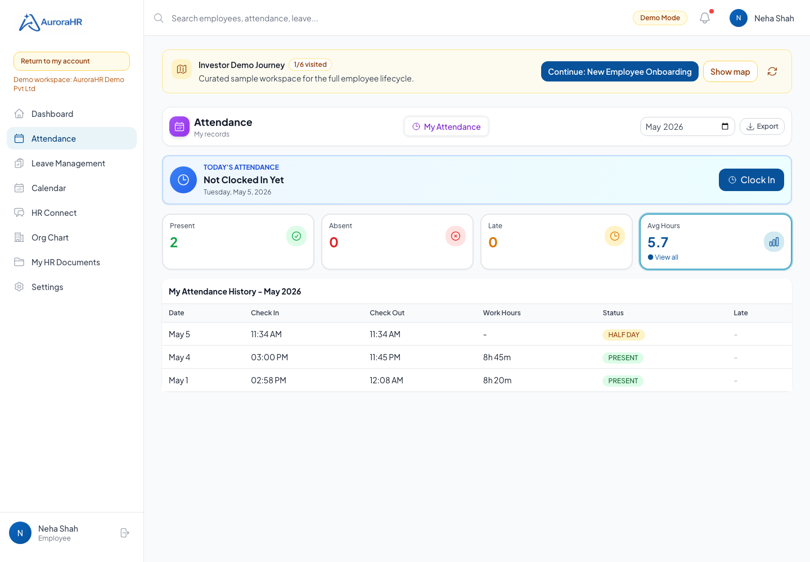

### VIS_ATT_EMP_02 - Employee regularization request modal

Role: employee


### VIS_LEAVE_EMP_01 - Employee leave balances, filters, and request history

Role: employee

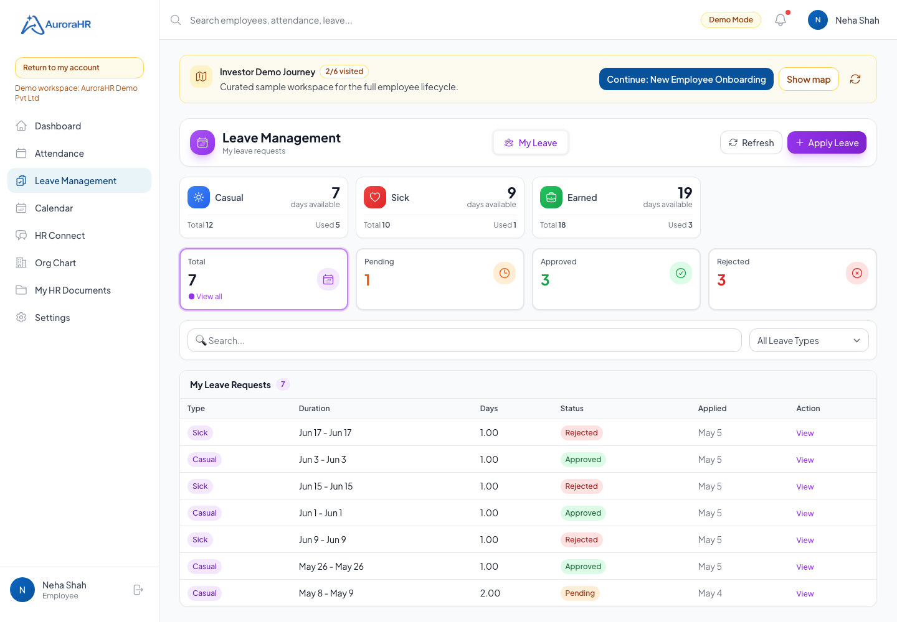

### VIS_LEAVE_EMP_02 - Employee apply leave modal

Role: employee

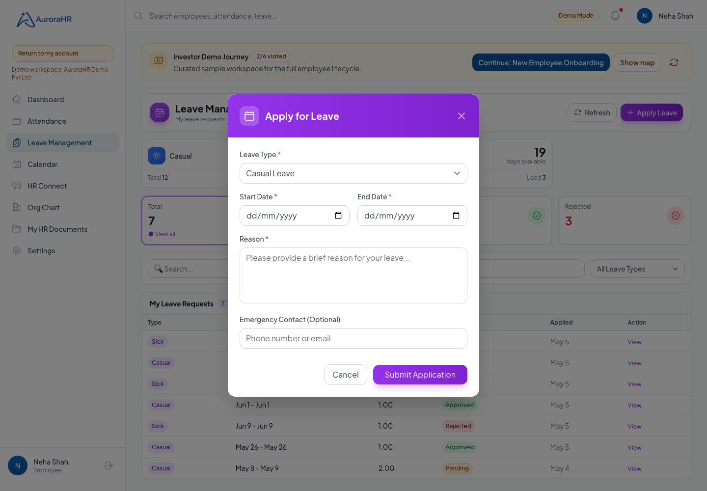

### VIS_ATT_MGR_01 - Manager team attendance view

Role: manager

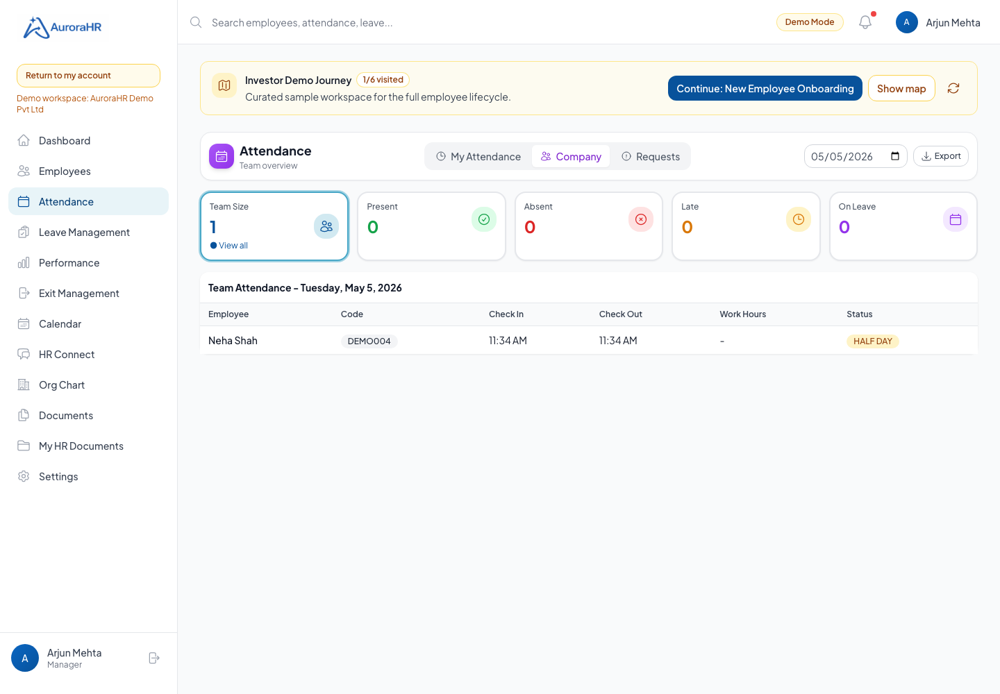

### VIS_ATT_MGR_02 - Manager pending leave and regularization approvals in attendance module

Role: manager

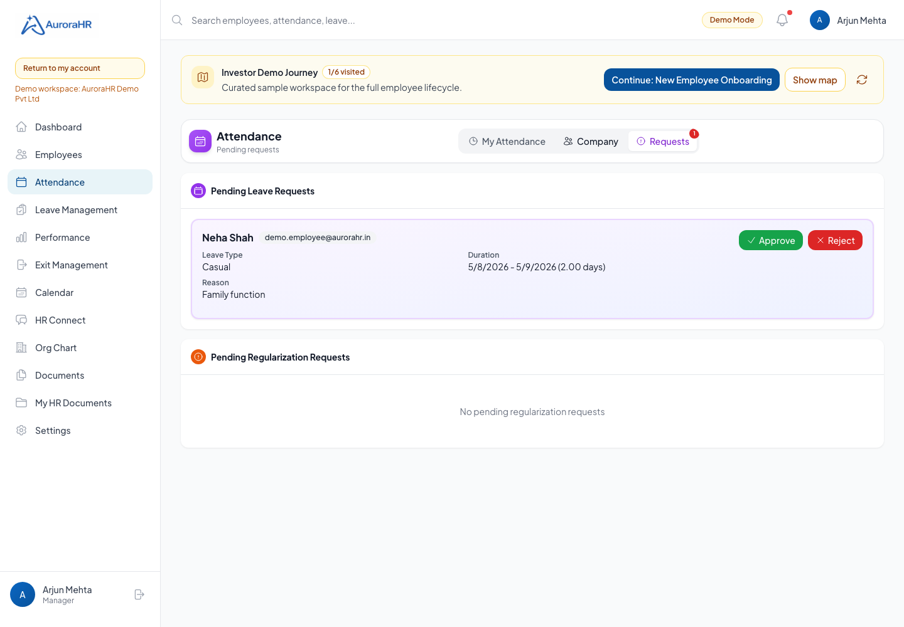

### VIS_LEAVE_MGR_01 - Manager team leave approvals view

Role: manager

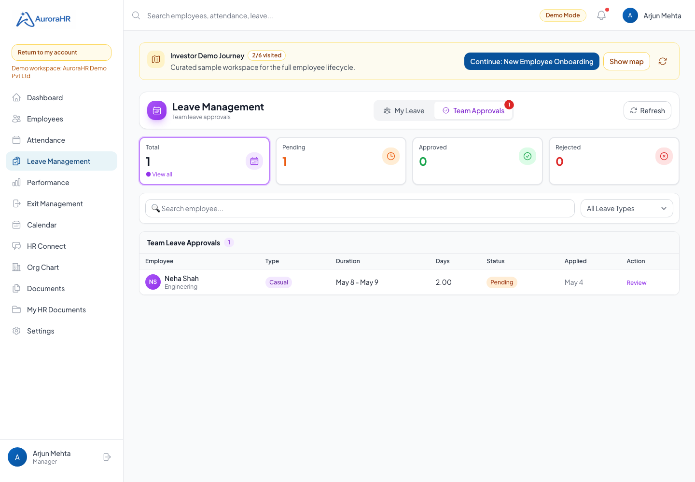

### VIS_ATT_HR_01 - HR company attendance daily control view

Role: hr

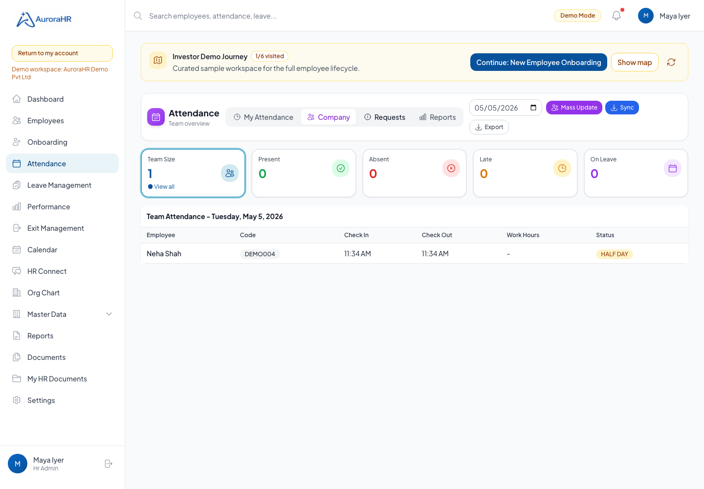

### VIS_ATT_HR_02 - HR attendance mass update modal

Role: hr

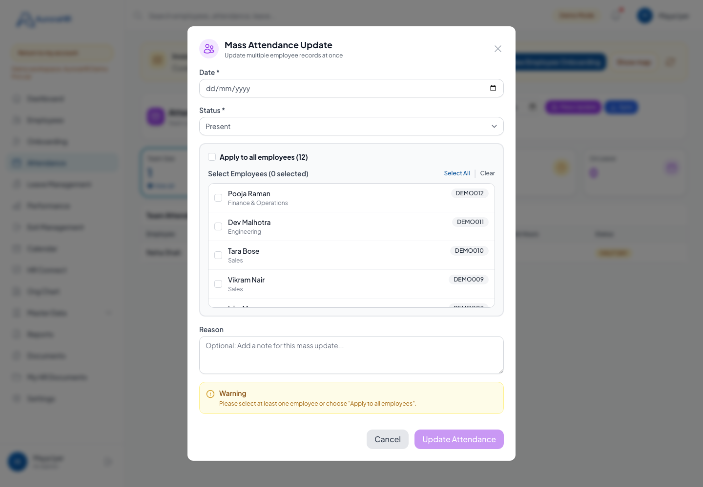

### VIS_ATT_HR_03 - HR attendance device/file sync modal

Role: hr

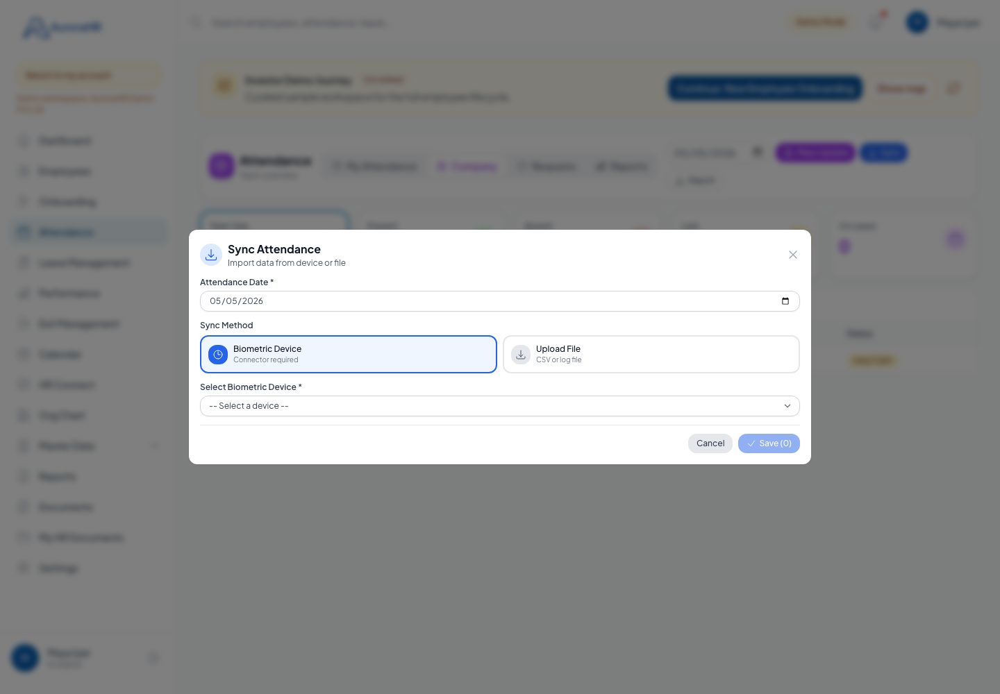

### VIS_ATT_HR_04 - HR attendance and leave intervention queue

Role: hr

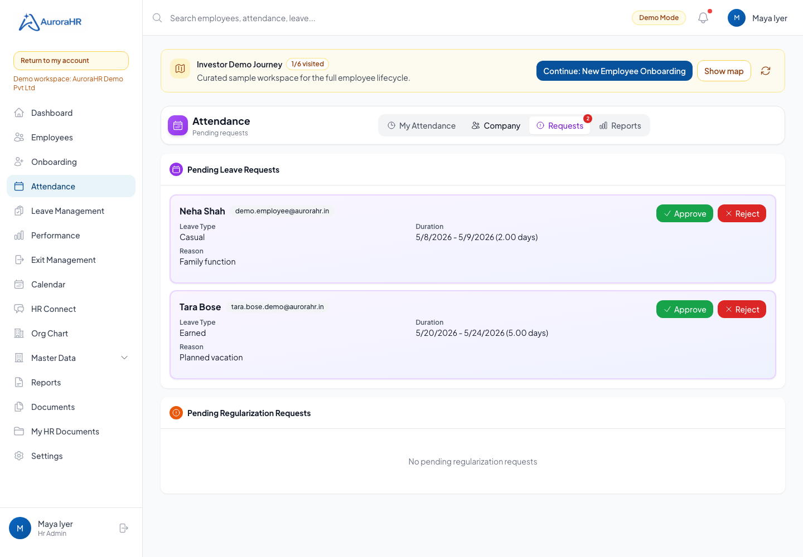

### VIS_LEAVE_HR_01 - HR all leave requests and intervention view

Role: hr

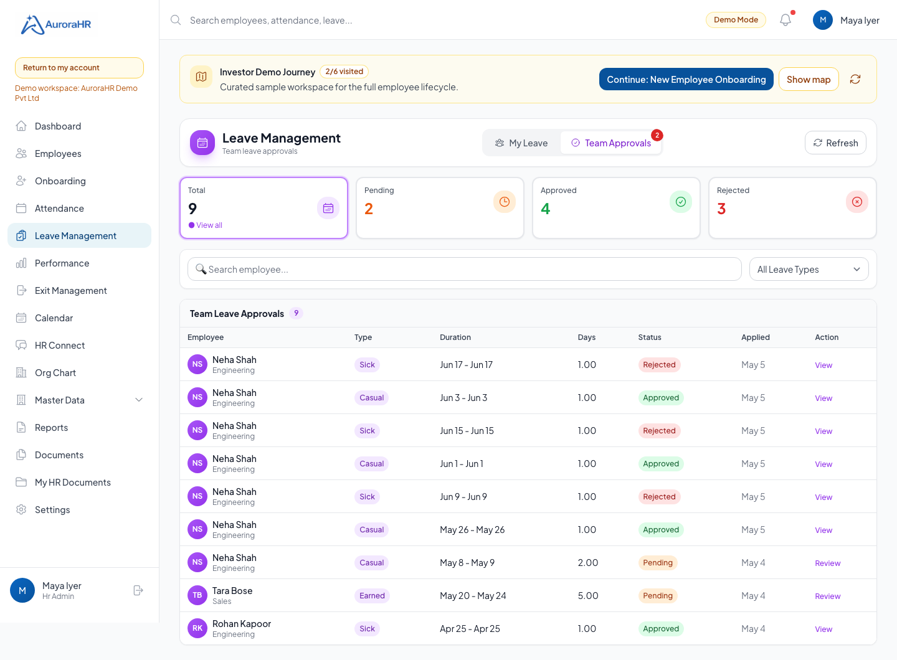

### VIS_REPORT_HR_01 - HR attendance and leave reports view

Role: hr

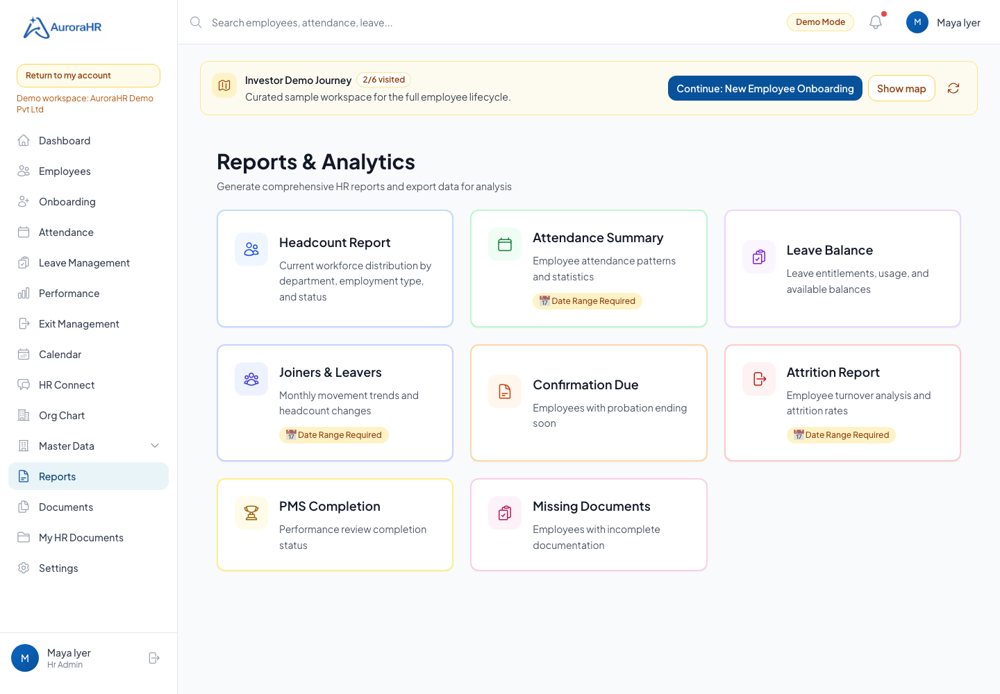

### VIS_ATT_ADMIN_01 - Leadership/admin attendance view

Role: admin

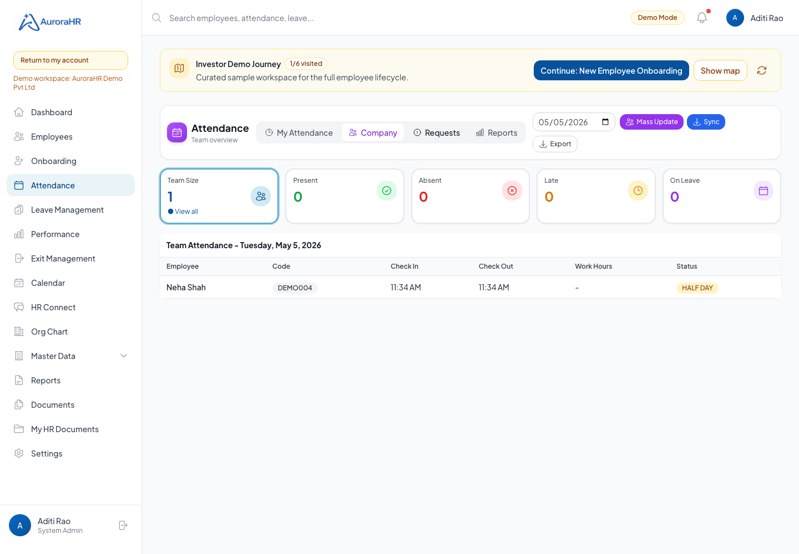

### VIS_LEAVE_ADMIN_01 - Leadership/admin leave view

Role: admin

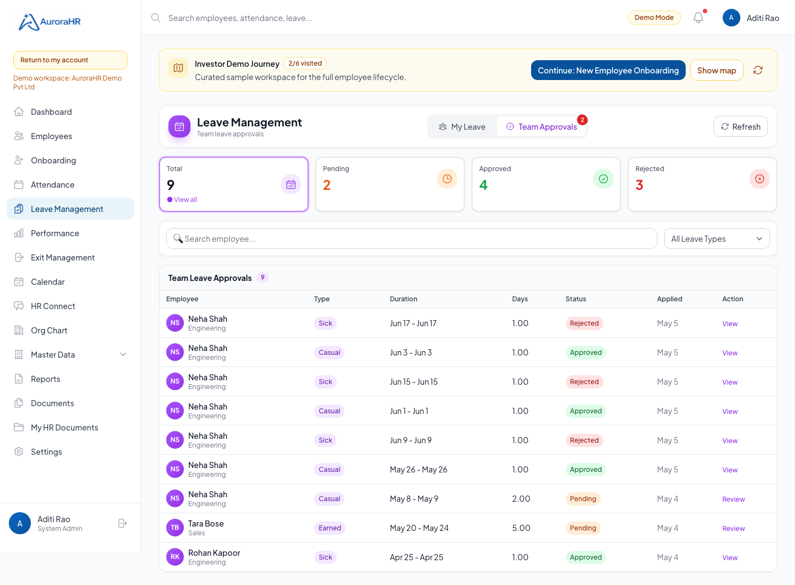


## Coverage notes

- Employee: monthly attendance, daily clock behavior, attendance regularization modal, leave balances, request list, apply-leave modal.
- Manager: team/company attendance, pending attendance regularization queue, leave approval queue.
- HR: company attendance controls, backend bulk update API, mass-update modal, sync modal, intervention queues, leave all-request view, reporting APIs.
- Leadership/admin: admin attendance and leave views using elevated demo persona.

## Product gaps observed

- Attendance Mass Update now uses the backend bulk-update path; this run verifies the backend endpoint and asserts the modal renders.
- Attendance Sync now uses uploaded CSV preview data and saves valid rows through the backend bulk-update path; this run asserts the Sync modal renders.
- Reporting APIs and the HR Reports tab are available; this run verifies attendance statistics, department statistics, leave statistics, and visual report access.
- Demo data is useful for visual QA, but repeated QA runs add extra demo leave and regularization records unless the demo seed reset is run.

## Re-run command

```bash
node scripts/qa/attendance-leave-visual-test.mjs
```

