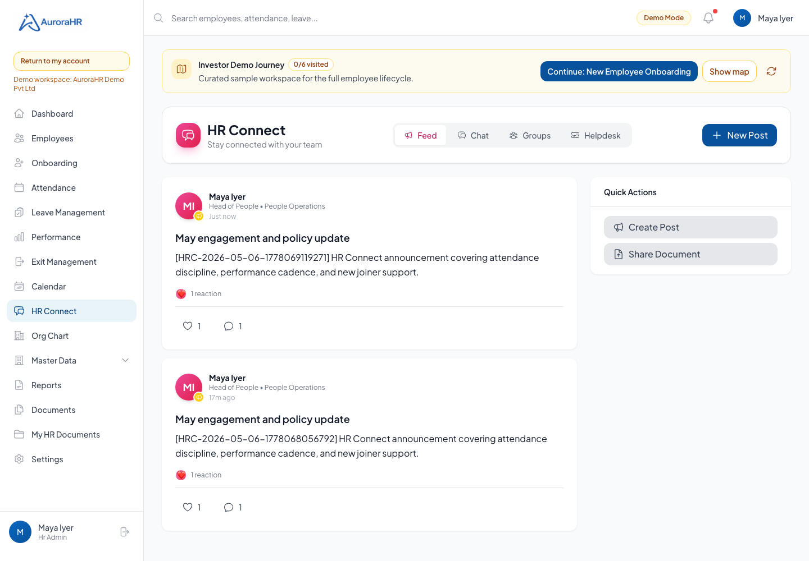
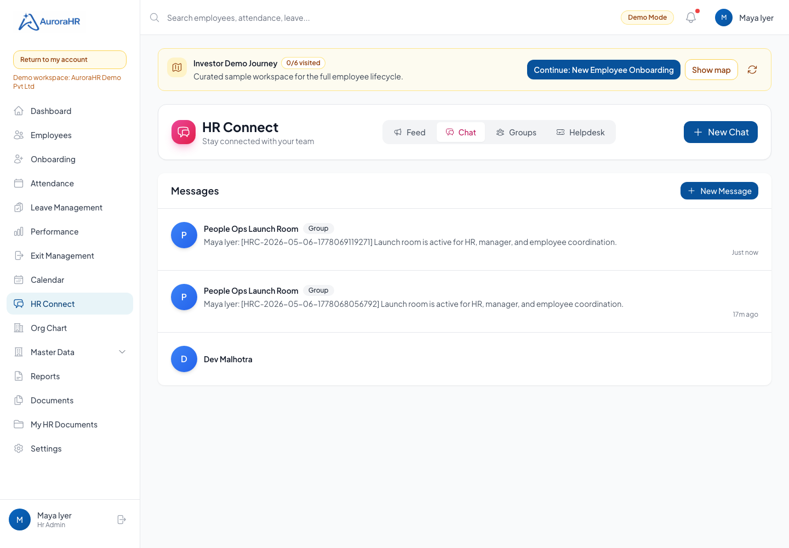
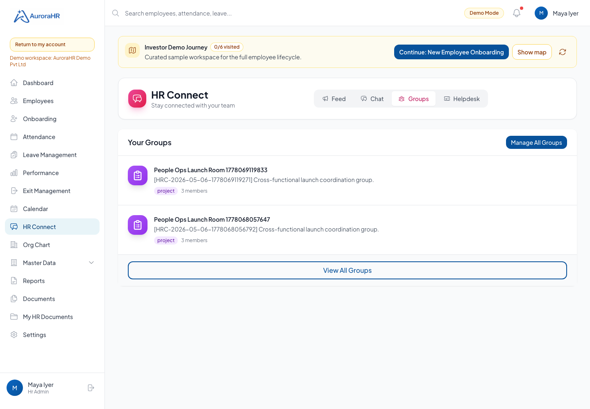
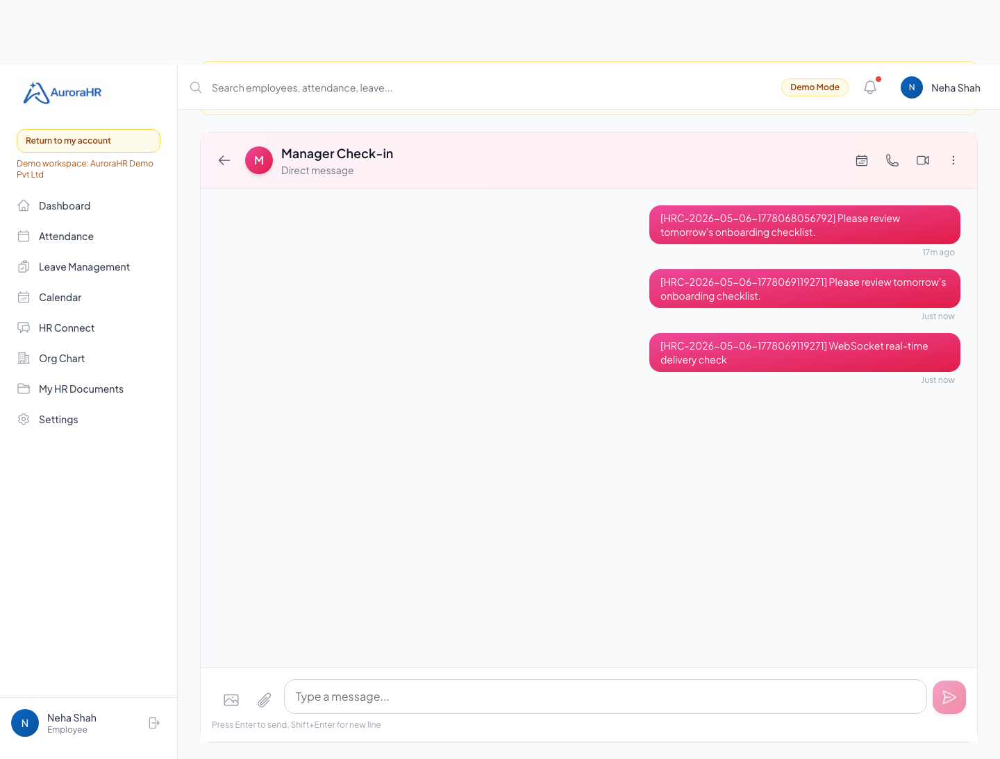
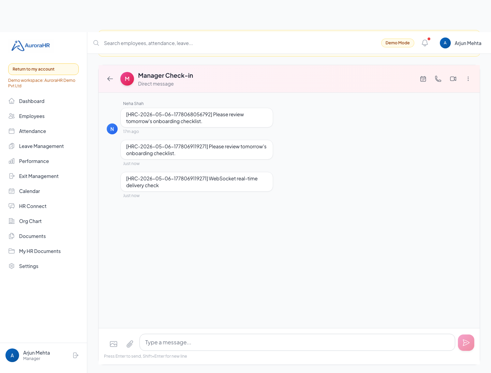
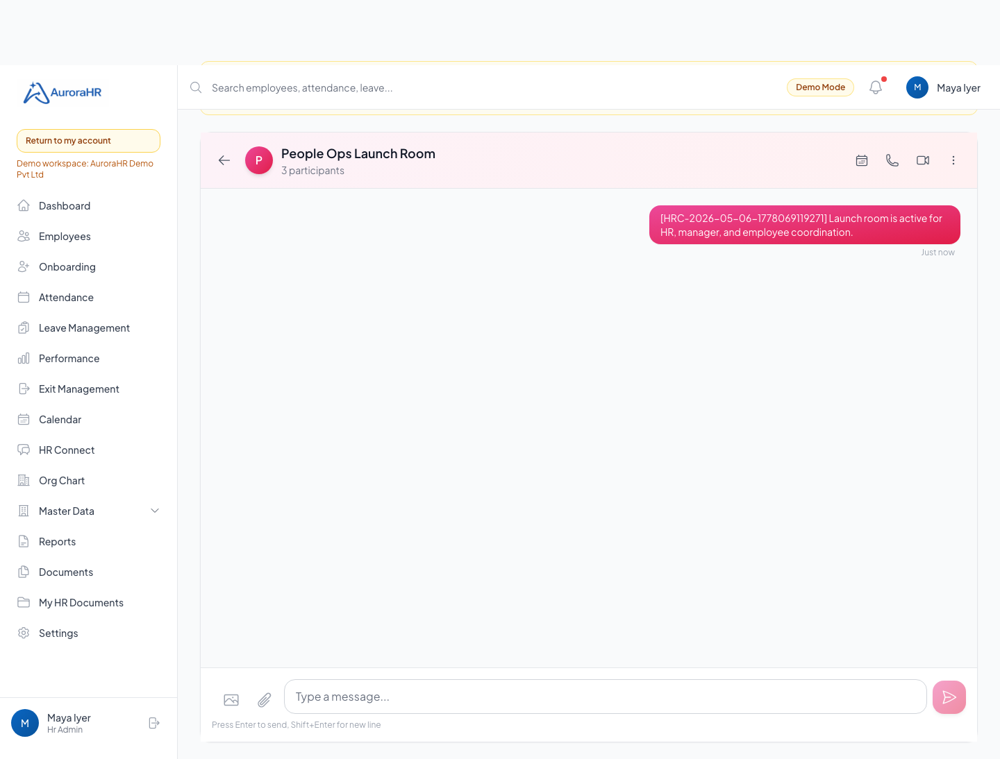
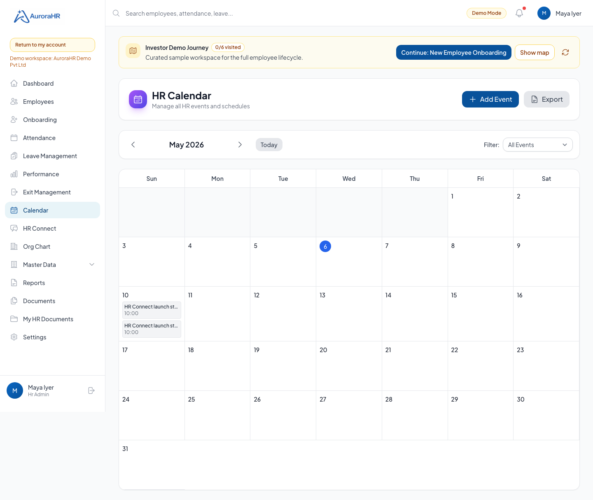

# HR Connect Production Readiness Visual QA

Run date: 2026-05-06  
Run id: HRC-2026-05-06-1778069119271  
Target: https://aurorahr.in

## Executive Outcome

HR Connect was tested as a real collaboration module, not only as a static page. The scenario covers feed posts, reactions, comments, persistent groups, direct chat, group chat, Socket.IO delivery, audio/video call signaling, and appointment scheduling through calendar persistence.

Status: PASS  
Passed: 26  
Failed: 0

## Storyline

The HR manager publishes a company update. An employee reacts, a manager comments, and HR creates a cross-functional project group. HR then adds the manager and employee to that group, creates both direct and group chat conversations, schedules a follow-up appointment, and validates that the employee and manager can see and use the same collaboration thread. Socket.IO is tested separately to prove real-time delivery and call signaling are active.

## Test Cases

| ID | Use Case | Role | Result | Evidence | Notes |
| --- | --- | --- | --- | --- | --- |
| AUTH_EMPLOYEE | Demo login for employee | employee | PASS | API /demo/login | demo.employee@aurorahr.in |
| AUTH_MANAGER | Demo login for manager | manager | PASS | API /demo/login | demo.manager@aurorahr.in |
| AUTH_HR | Demo login for hr | hr | PASS | API /demo/login | demo.hr@aurorahr.in |
| AUTH_ADMIN | Demo login for admin | admin | PASS | API /demo/login | demo.admin@aurorahr.in |
| HRC_FEED_01 | HR creates a company HR Connect announcement | hr | PASS | postId=c63d046e-b035-43a6-bbe6-95d91f34bfde |  |
| HRC_FEED_02 | Employee reacts and manager comments on the announcement | employee/manager | PASS | commentId=0a60767e-f68f-4dcb-85dd-c7012c2c3b9d |  |
| HRC_GROUP_01 | HR creates a cross-functional project group | hr | PASS | groupId=6b132ba1-084a-4600-a0d3-0d1c54c5af7e |  |
| HRC_GROUP_02 | HR adds manager and employee to the group through persistent group-member API | hr | PASS | members=3 |  |
| HRC_CHAT_01 | Employee opens or creates direct chat with manager | employee | PASS | conversationId=8fac722c-9008-498a-835a-c9c1eef54e8b |  |
| HRC_CHAT_02 | Employee sends a direct chat message and manager can retrieve it | employee/manager | PASS | messageId=09fbe94b-c3a2-4a8b-b616-26d309d27708 |  |
| HRC_CHAT_03 | HR creates group chat from group members and posts a group update | hr | PASS | conversationId=e67da6de-2bb1-4bc0-ac14-eaaceddc485a, messageId=4c8df120-519c-4369-bc1f-a04fb88ef3e5 |  |
| HRC_CAL_01 | HR schedules an appointment linked to HR Connect chat | hr | PASS | eventId=9d1efbbc-e177-405b-8c3f-6b721a6a7d18 |  |
| HRC_CAL_02 | Scheduled appointment is returned by calendar list and upcoming views | employee | PASS | eventId=9d1efbbc-e177-405b-8c3f-6b721a6a7d18 |  |
| HRC_WS_01 | Manager receives real-time chat message over Socket.IO | employee/manager | PASS | messageId=b018cd18-e604-4052-ab8d-f0154cc416bf |  |
| HRC_CALL_01 | Audio call signaling delivers incoming call event | employee/manager | PASS | callerId=03b6d7bb-48d1-462f-9749-830340234960 |  |
| HRC_CALL_02 | Call answer signaling returns to caller | employee/manager | PASS | call_answered event |  |
| HRC_CALL_03 | Video call signaling delivers incoming call event | employee/manager | PASS | callerId=03b6d7bb-48d1-462f-9749-830340234960 |  |
| HRC_WS_00 | Socket.IO chat and call signaling scenario | employee/manager | PASS | completed |  |
| VIS_01 | HR Connect feed shows announcement, reactions, and social workflow | hr | PASS | screenshots/01-hr-connect-feed.png |  |
| VIS_02 | HR Connect chat list presents direct and group conversations | hr | PASS | screenshots/02-hr-connect-chat-list.png |  |
| VIS_03 | HR Connect group management shows persistent project group membership | hr | PASS | screenshots/03-hr-connect-groups.png |  |
| VIS_04 | Employee direct chat shows message history and action hooks | employee | PASS | screenshots/04-employee-direct-chat.png |  |
| VIS_05 | Manager direct chat confirms counterpart view of the same conversation | manager | PASS | screenshots/05-manager-direct-chat.png |  |
| VIS_06 | HR group chat supports multi-participant coordination | hr | PASS | screenshots/06-hr-group-chat.png |  |
| VIS_07 | Calendar shows HR Connect appointment created through persistent calendar API | hr | PASS | screenshots/07-calendar-appointment.png |  |
| HRC_VIS_00 | Browser visual journey with HR, manager, and employee roles | hr/manager/employee | PASS | completed |  |

## Screenshots

### HR Connect feed shows announcement, reactions, and social workflow
Role: hr

### HR Connect chat list presents direct and group conversations
Role: hr

### HR Connect group management shows persistent project group membership
Role: hr

### Employee direct chat shows message history and action hooks
Role: employee

### Manager direct chat confirms counterpart view of the same conversation
Role: manager

### HR group chat supports multi-participant coordination
Role: hr

### Calendar shows HR Connect appointment created through persistent calendar API
Role: hr

## Residual Production Note

Audio/video media negotiation uses browser WebRTC with STUN. The QA validates authenticated signaling and browser media hooks. A TURN server is still recommended before promising reliable calls across restrictive corporate networks.
