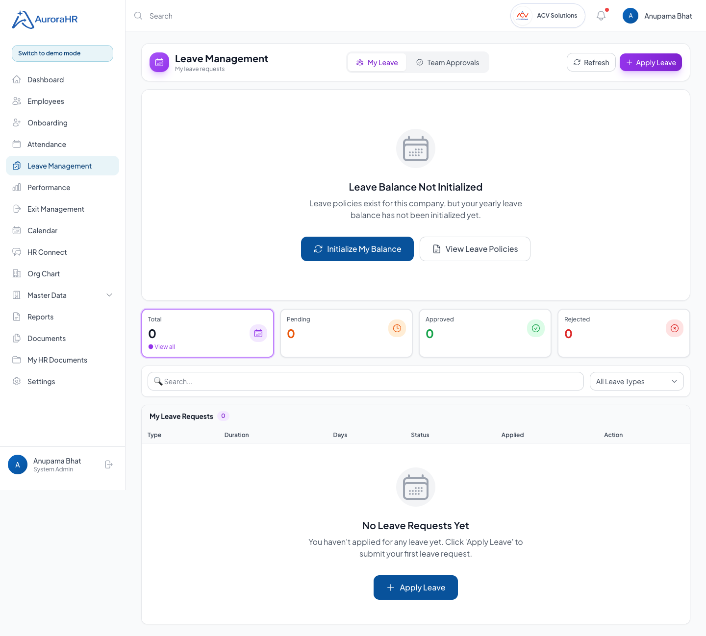
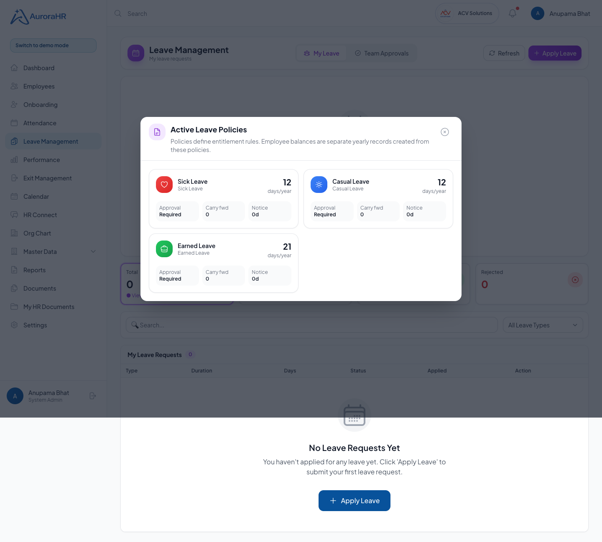
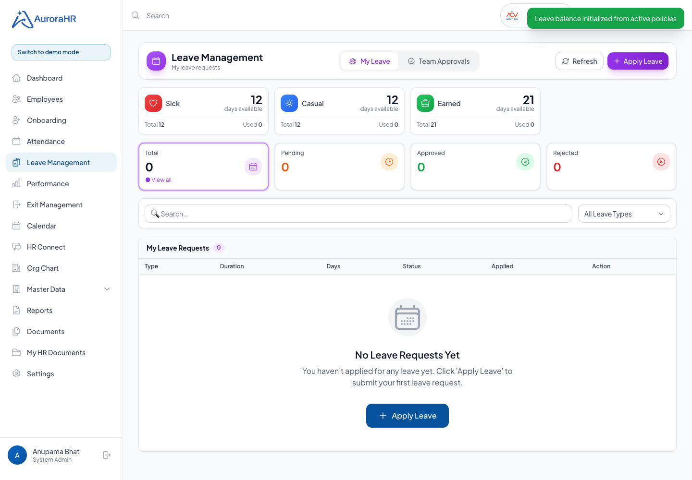
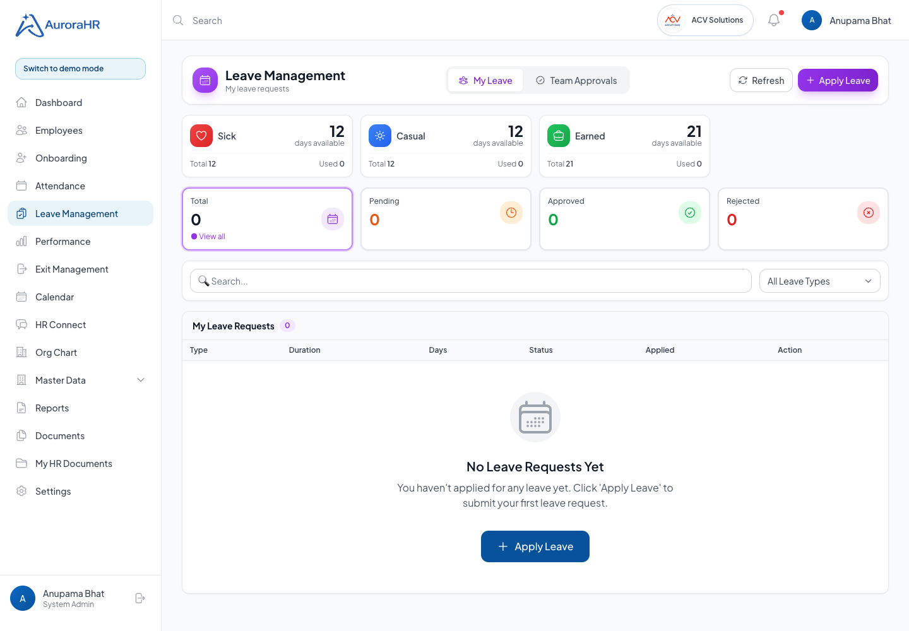
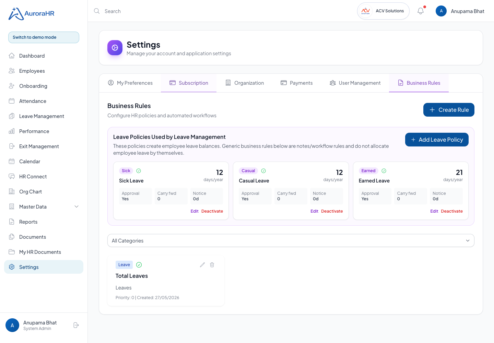
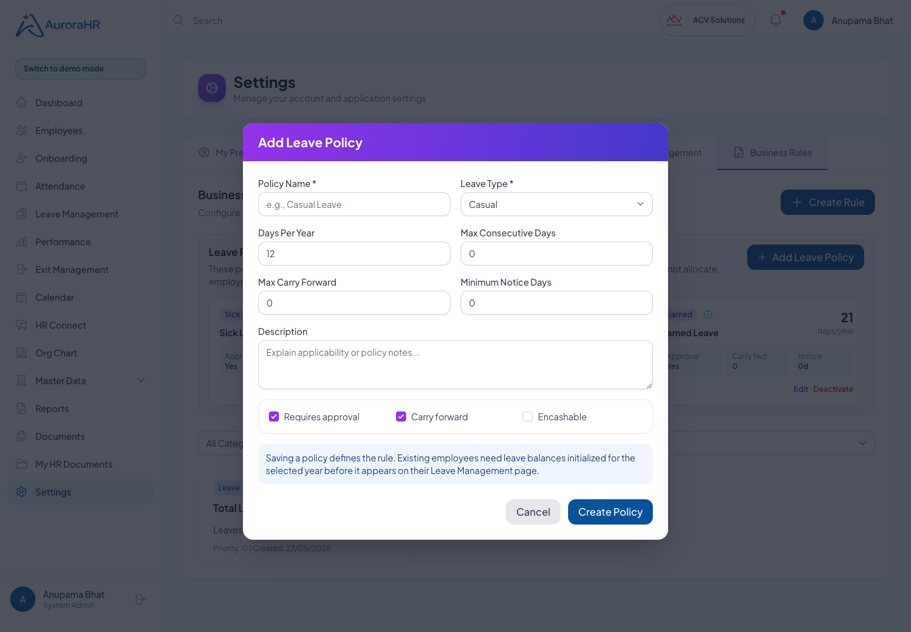
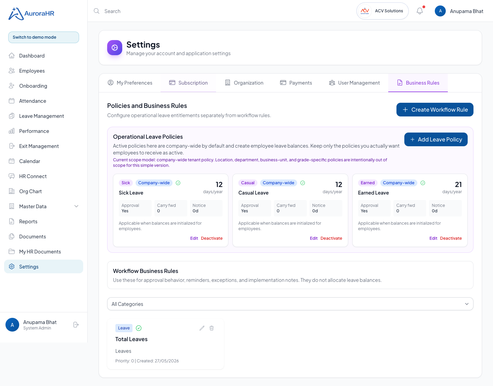
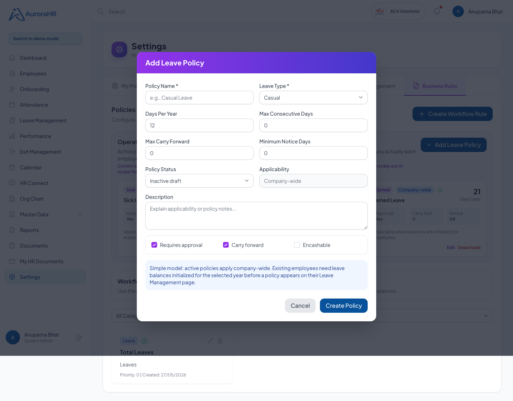

# Leave Management Policy and Balance Readiness QA

Run date: 2026-05-27
Run id: leave-management-policy-balance-2026-05-27
Target: http://localhost:5173
API: http://localhost:3000/api/v1
Persona used: anupama.bhat@acvsolutions.in

## Executive Summary

- Passed: 14 assertions
- Failed: 0
- API failures: 0
- Verdict: The specific confusing journey is repaired locally. Leave policies can now be viewed from Leave Management, leave balances can be initialized from active policies, and Settings exposes real Leave Policy management instead of forcing HR users through generic Business Rules.

## Problem Investigated

The Leave Management landing page showed "No Leave Balance Configured" even though ACV had leave-related setup under Settings. The "View Leave Policies" button did not do anything. The deeper issue was a data-model mismatch:

- `business_rules` store generic workflow/configuration notes.
- `leave_policies` define actual leave entitlements.
- `leave_balances` are employee/year records created from active leave policies.

Creating a generic leave business rule does not create employee leave balances, so the Leave page correctly had no balance data but explained it poorly.

## Repairs Made

| Area | Issue | Repair |
| --- | --- | --- |
| Leave page policy action | "View Leave Policies" only logged to console. | Added a real modal showing active tenant leave policies. |
| Employee leave balance empty state | The page did not distinguish between "no policies" and "policies exist but balance not initialized." | Added precise empty-state messaging and an HR/admin action to initialize the current user's balance. |
| API access | Employees had no simple authenticated endpoint to view active policies. | Added `GET /leave/policies` for active tenant policies. |
| Settings journey | Settings > Business Rules created generic rules, not operational leave policies. | Added a real "Leave Policies Used by Leave Management" panel with Add/Edit/Deactivate controls. |
| Admin clarity | Users could reasonably assume generic business rules allocate leave. | Added explanatory text that balances are separate yearly records initialized from policies. |
| Product concept clarity | Users could not tell which policy was actually applicable. | Renamed the section to "Operational Leave Policies", marked policies as company-wide, defaulted new policies to inactive draft, and separated "Workflow Business Rules" from entitlement policies. |

## Test Outcomes

| ID | Use case | Expected | Actual | Status | Evidence |
| --- | --- | --- | --- | --- | --- |
| LM-POL-001 | Open Leave Management with policies but no balance | User sees a meaningful policy/balance state, not a dead-end. | Page loaded and showed the new leave policy/balance journey. | Passed | `screenshots/leave-before-policy-action.png` |
| LM-POL-002 | Click View Leave Policies | Modal opens and shows active policies. | Sick, Casual, and Earned Leave policies were visible. | Passed | `screenshots/leave-policies-modal.png` |
| LM-POL-003 | Initialize current user's leave balance | Balance cards appear from active policies. | Balance cards appeared with days available. | Passed | `screenshots/leave-after-balance-initialized.png` |
| LM-POL-004 | Reopen Leave landing after initialization | Leave balance cards remain visible. | Balance cards visible on landing. | Passed | `screenshots/leave-balance-cards-visible.png` |
| LM-POL-005 | Open Settings > Business Rules | Real Leave Policy management is visible. | Leave policy panel visible above generic business rules. | Passed | `screenshots/settings-leave-policy-panel.png` |
| LM-POL-006 | Click Add Leave Policy | Form opens for operational leave policy data. | Add Leave Policy modal opened. | Passed | `screenshots/settings-add-leave-policy-modal.png` |
| LM-POL-007 | Review simplified policy model in Settings | User can see operational policies are company-wide and workflow rules are separate. | Operational Leave Policies, company-wide scope, and Workflow Business Rules were visible. | Passed | `screenshots/settings-policy-simplified-model.png` |
| LM-POL-008 | Add policy modal status/scope clarity | New policy defaults to inactive draft and displays company-wide applicability. | Status and scope controls were visible and verified. | Passed | `screenshots/settings-policy-status-scope-modal.png` |

## API Proof

- `GET /leave/policies` returned 3 active ACV policies.
- `POST /leave/initialize-balance` initialized Anupama Bhat's current-year balances locally.
- Browser run recorded no API responses with status >= 400.

## Visual Proof

















## Residual Risks

- This pass focused on policy/balance confusion, not the full leave approval lifecycle.
- Bulk balance initialization for all active employees is still a needed HR implementation feature.
- Policy changes do not automatically recalculate existing employee balances; that should remain deliberate and audited.
- Employee-only and manager-only role visual checks are still pending.
- Leave cancellation, rejection, insufficient balance, overlapping dates, and direct URL permission checks still need a full scripted QA pass.

## Rerun Commands

```bash
cd /Users/chinar.deshpande06/Documents/GitHub/HRMS-SaaS-MVP/backend
npm run build
npm run dev

cd /Users/chinar.deshpande06/Documents/GitHub/HRMS-SaaS-MVP/frontend-web
VITE_API_URL=http://localhost:3000/api/v1 npm run dev -- --host localhost
```
